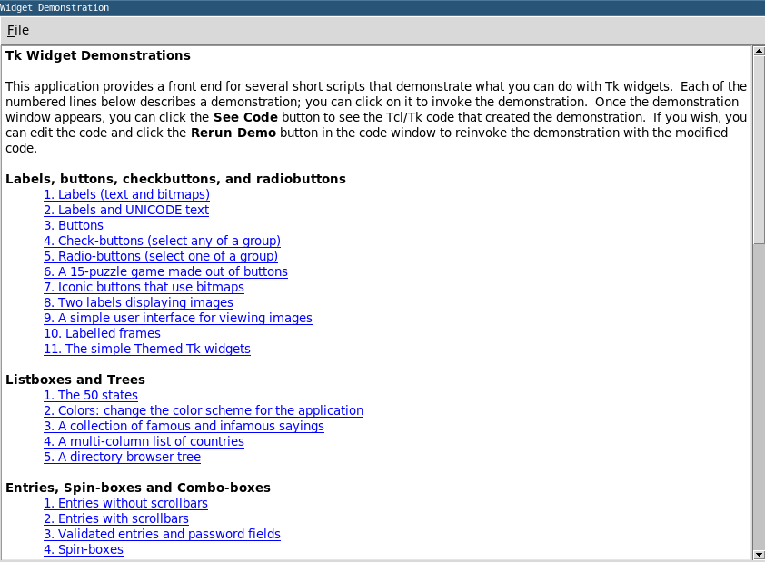
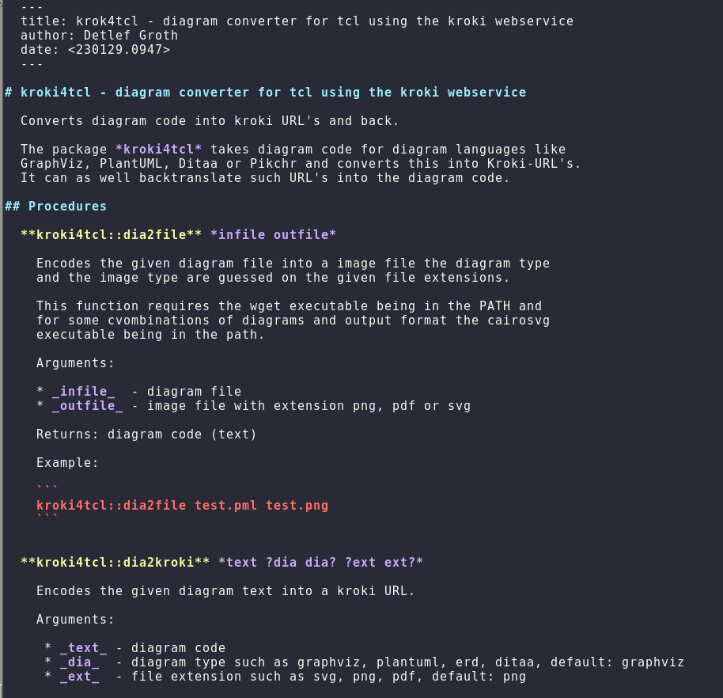

# tclmain

Standalone script to run Tcl applications from packages using the - `tclmain -m pkgname` - syntax.

This Tcl application provides a facility to run Tcl applications, display help
pages and show demo  applications  for Tcl  packages,  similar like the Python
`__main__.py`  file is doing  this for a Python  package.  In  Python, if your
provide a file  `__main__.py`  within your package, you can exectute this file
directly  using the syntax: `python -m pkgname`. The Tcl script  `tclmain.tcl`
does a similar  thing. As usually  for  standalone  scripts  scripts  the file
extension will be removed, I will below use its name as `tclmain`.

In  addition  to this Python like  approach  providing  separate  files in the
package  itself,  since version 0.2.0  (2023-09-30) it is as well supported to
call a main function in the form of `package::main argv`. Here an example of such
an implementation:

```{.tcl}
package provide testx 0.0.1

namespace eval ::testx { }

proc ::testx::hello {name} {
    puts "Hello ${name}!"
}   

proc ::testx::main {{argv {}}} {
    if {[llength $argv] != 1} {
        puts "Usage: tclmain -m testx NAME"
    } else {
        testx::hello [lindex $argv 0]
    }   
}
```

Here an example session:

```
[tclmain]$ export TCLLIBPATH=.
[tclmain]$ tclsh bin/tclmain.tcl -i testx 
package:  testx
version:  0.0.1
location: ./examples
[tclmain]$ tclsh bin/tclmain.tcl -m testx 
Usage: tclmain -m testx NAME
[tclmain]$ tclsh bin/tclmain.tcl -m testx  Tclmain
Hello Tclmain!
```

So the only thing a package  writer  needs to make it  runnable  directly as an
application using `tclmain` is to provide this main function  within the `namespace`  which must
have the same name as the  package  itself  and  getting  only the argv as the
first and only argument with a default of an empty list.

## Installation

* currently only Linux/Unix systems are supported
* in principle  the approach  should work on Windows as well, but I can't test
  it properly
* you only need a single file for using the tclmain approach
* download the file [tclmain.tcl](bin/tclmain.tcl) (you need to press raw to get the file)
* make it executable using the `chmod` command
* rename it to `tclmain` and move it to a folder belonging to your `PATH` variable, I place mine into `~/.local/bin`
* check the installation by writing `tclmain` in your terminal where you should see the help page
* done

## Examples

Here is an example on how to execute programs or get help pages by a user or developer if a package developer used this facilities by creating several files in his/her package folder. These files `tclmain_xyz.tcl` needs not to be sourced in the `pkgIndex.tcl` file.

* `tclmain` - gives the help message
* `tclmain -h, --help` - gives the help message
* `tclmain -i, --info` - gives information about a Tcl package
* `tclmain -m, --module pkgname` - lists the available commands for the package `pkgname`
* `tclmain -p, --package pkgname` - lists the available commands for the package `pkgname`
* `tclmain -p pkgname main` - executes the file ending with `_main.tcl` within the package directory
* `tclmain -p pkgname help` - executes the file ending with  `_help.tcl` which should provide the help pages for the packages, or get's a hint of how to get see them
* `tclmain -p pkgname demo` - executes the file ending with `_demo.tcl` which could provide a short demo
* `tclmain -m pkgname xxx` - executes the file ending `_xxx.tcl` and so on, may be this is better implemented as `tclmain pkgname run xxx` so as an command line argument to the `tclmain_run.tcl script`, only three letter commands should be provided

## Config folder 

There should be as well a possibility to provide these facilities if you are
not having access to the package folders. It can't be assumed that a lot of
Tcl packages will offer this functionality at any time soon. In this case you
should be able to place these files witin your own configuration folder like
`~/.config/tclmain/pkgname_main.tcl` or `~/.config/tclmain/pkgname_demo.tcl`
on a Linux/Unix system. That way you can add these facilities to Tcl packages
which does not use the `tclmain` approach. 

Colons in the package name should be replaced in this case with underlines. So
for the package `canvas::zoom` the filename becomes `canvas_zoom_main.tcl` for
instance.

## Tclsh

The Tclsh should provide such an approach using a module/package flag like
Python, for instance `tclsh -m pkgname` or `tclsh -p pkgname`

## Examples

Here a few examples to add this functionality to existing packages. As
`tclmain` strips of the `pkgname` argument, the first argument is run in the
`argv` list.

Here is a example file [examples/Markdown_main.tcl](Markdown_main.tcl). Thsi
file should be placed in the config folder for `tclmain` so on a Unix/Linux system
here `~/.config/tclmain/Markdown_main.tcl`.

This file using the Markdown library of Tcllib and your helper file
[Markdown_main.tcl](examples/Markdown_main.tcl) which must be placed in `.config/tclmain`.
You could execute this file then like this:

```

$  tclmain -m Markdown 
Missing command for package Markdown.
Available commands are: main
$  tclmain -m Markdown main
Usage: tclmain -m Markdown main mdfile|- ?htmlfile|-?
       instead of filenames as well - can be used to indicate stdin and stdout

Example:
   echo '**Hello World!**' |  tclmain -m Markdown main - out.html
   
$  echo '**Hello world!**'  | tclmain -m Markdown main -
<p><strong>Hello world!</strong></p>

```

Here an other example to run the Tk demo. Create a file `Tk_demo.tcl` with the
following content:.

```
#!/usr/bin/env tclsh

foreach folder $auto_path {
    set demo [file join $folder demos widget]
    if {[file exists $demo]} {
        source $demo
        break
    }
}

```

The file is as well available in the repository in the examples section.
Place this file in your config folder `~/.config/tclmain`. Thereafter you can
have the following session.

```
$ tclmain -i Tk
package:  Tk
version:  8.6.12
location: /usr/lib64
$ tclmain -m Tk
Missing command for package Tk.
Available commands are: demo
$ tclmain -m Tk demo
```

You should then see the following window:



Obviously you could have the same effect if you would place the files in the config folder

## Packages with Tclmain support

I started adding for some packages inbuild Tclmain support. More packages will follow, here are the links:

* [tclinstall](https://github.com/mittelmark/tclmain/lib/tclinstall) - installer package, commands `main` and `help`
* [kroki4tcl](https://github.com/mittelmark/kroki4tcl) - commands `main` and `api`
* [yeti](https://github.com/mittelmark/yeti) - commands `help` for yeti and ylex (showing the help pages)

Here is an example session for kroki4tcl:

```
$ tclmain -i kroki4tcl
package:  kroki4tcl
version:  0.4.0
location: /home/groth/.local/lib/kroki4tcl
$ tclmain -m kroki4tcl 
Missing command for package kroki4tcl.
Available commands are: main,api
$ tclmain -m kroki4tcl api | less -r
```

This is the output:



If all Tcl packages would have a file with under-help or underline-api at the
end we would always be able to query the documentation in the same manner ... just dreaming ...


## TODO's

- main as default mode, but how to distinguis between command and arguments?
- more examples for the config folder, like Tk demo (done)
- currently the files in config folder will be evaluated first, what happend if the package developers will then create its own file pkg_name.tcl for instance?

## Links

- [Tclers Wiki](https://wiki.tcl-lang.org/page/tclmain) - for suggestions and ideas
- [Issues](https://github.com/mittelmark/tclmain/issues) - do tell bugs and issues
